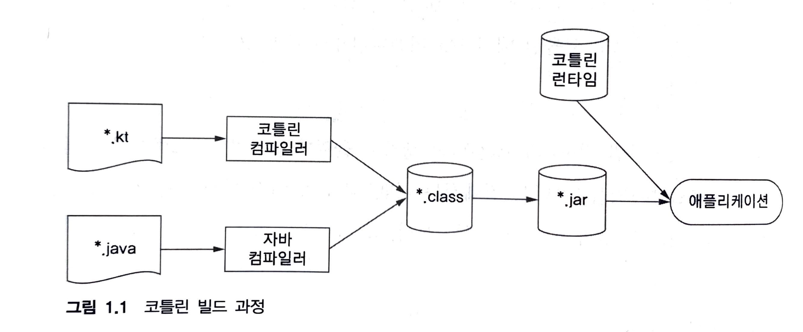

# Kotlin

# 1. 코틀린이란 무엇이며, 왜 필요한가?

## 1. 코틀린 맛보기

## 1.2 코틀린의 주요 특성

### 1.2.1 대상 플랫폼: 서버, 안드로이드 등 자바가 실행되는 모든 곳

### 1.2.2 정적 타입 지정 언어

- 타입을 자동으로 유추 (타입추론)
- 성능: 메서드 호출이 더 빠르다
- 신뢰성
- 유지 보수성
- 도구지원 <- 뒤에도 계속 나오지만 JetBrain의 IDE의 지원을 제대로 받을 수 있다는 점이 좋은듯

### 1.2.3 함수형 프로그래밍과 객체지향 프로그래밍

- 일급 시민(first-class)인 함수
  - 함수를 일반 값 처럼, 변수에 저장, 인자로 다른 함수로 전달, 함수에서 새로운 함수 만들어서 반환
  - 현대 언어에서 그렇게 새로운 특징은 아니지만, Swift 개발에서도 체감하듯이 함수형 프로그래밍도 가능하다는 것은 엄청난 장점이다
- 불변성(immutability)
  - 코틀린에서 불변 객체를 어떻게 지원할지 기대하면서 읽어보는 중
- 부수 효과(side effect) 없음: 순수 함수

```kt
func findAlice() = findPerson { it.name == "Alice" }
```

- Swift와 다르게 $0 이 아니라 it으로 접근. 여러개 일때는 어떻게 접근할까? 

## 1.3 코틀린 응용

### 1.3.1 코틀린 서버 프로그래밍

- HTML 웹 애플리케이션
- JSON API 제공하는 백엔드 애플리케이션
- RPC 프로토콜을 통해 서로 통신하는 마이크로서비스

- DSL도 잘 제공함

```kt
fun renderPersonList(persons: Collection<Person>) = {
    creatHTML().table {
        for (person in persons) {
            tr {
                td { +preson.name }
                td { +person.age }
            }
        }
    }
}
```

```kt
object CountryTable : IdTable() {
    val name = varchar("name", 250).uniqueIndex()
    val ios = varchar("iso", 2).uniqueIndex()
}
class Country(id: EntityID) : Entity(id) {
    var name: String by ContryTable.name
    var iso: String by CountryTable.iso
}
```

테이블 구조 작성하는 DSL은 영어로 설명하듯이 작성되는 장점이 있어 보인다

### 1.3.2 코틀린 안드로이드 프로그래밍

- 코틀린을 사용하더라도 성능 측면에서 아무 손해가 없다.
- 코틀린 컴파일러가 생성한 바이트코드는 일반적인 자바 코드와 똑같이 효율적으로 실행된다.

## 1.4 코틀린의 철학

### 1.4.1 실용성

- 멀티 패러다임: 특정 프로그래밍 스타일이나 패러다임을 사용할 것을 강제로 요구하지 않는다.

### 1.4.2 간결성

- 자바에서 사용되던 게터, 세터, 생성자 파라미터 등을 코틀린은 묵시적으로 제공함
- 코드를 구현할 때 기호만으로 이루어진 연산자 식별자를 대치할 수 없음
- 기호 보다 단어로 이뤄진 이름이 훨씬 더 읽거나 검새갛기 쉽다 <- 이거 굉장히 마음에 든다

### 1.4.3 안정성

- 일부 유형의 오류를 프로그램 설계가 원천적으로 방지
- 안전성과 생산성 사이에는 트레이드오프 관계가 성립

```kt
if (value is String)
    printlin(value.toUppserCase()) // 여기서 value는 String으로 안전하게 캐스팅 된것으로 보임
```

### 1.4.4 상호운용성

- 자바 <-> 코틀린 서로 호출할 때 어떤 교묘한 장치도 필요없다.
- 이거는 objective-c <-> swift 도 어느정도 지원하지만 브릿징을 연결해줘야하는 번거로움이 있는데, 코틀린에서는 정말로 전혀 없는건지 궁금하다
- 코틀린이 제공하는 풍부한 API는 실행 시점에 아무런 부가 비용을 야기하지 않는다.

## 1.5 코틀린 도구 사용

### 1.5.1 코틀린 코드 컴파일



### 1.5.5 온라인 놀이터

[http://try.kotl.in/](http://try.kotl.in/)

