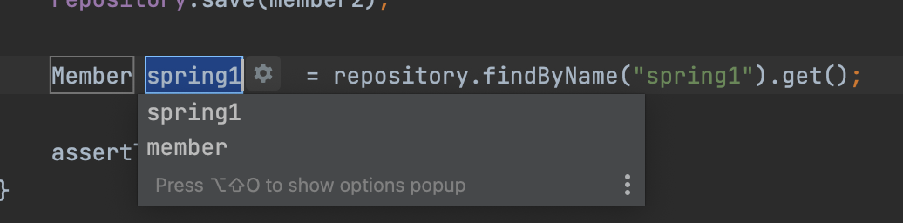
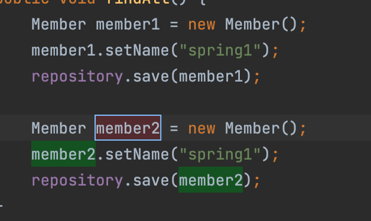
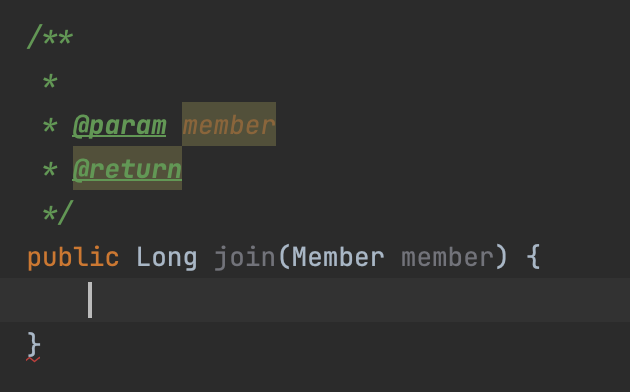
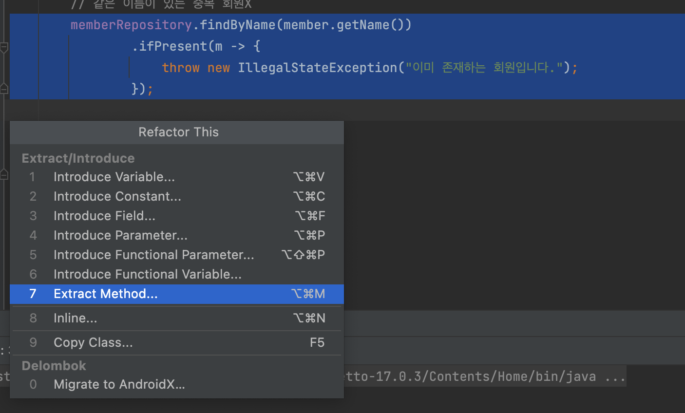
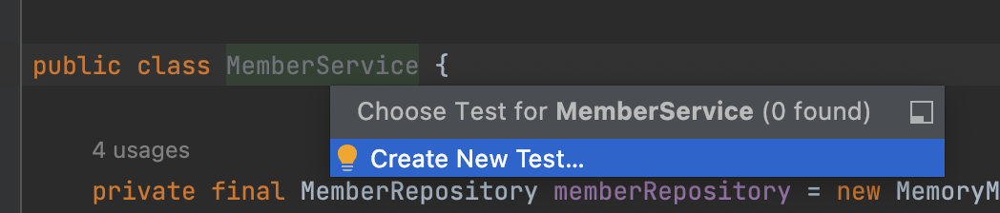
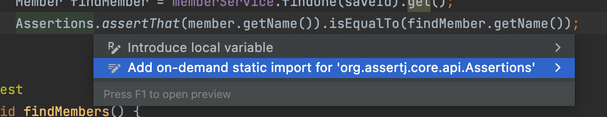

# 스프링 입문 - 코드로 배우는 스프링 부트, 웹 MVC, DB 접근 기술

[https://www.inflearn.com/course/%EC%8A%A4%ED%94%84%EB%A7%81-%EC%9E%85%EB%AC%B8-%EC%8A%A4%ED%94%84%EB%A7%81%EB%B6%80%ED%8A%B8](https://www.inflearn.com/course/%EC%8A%A4%ED%94%84%EB%A7%81-%EC%9E%85%EB%AC%B8-%EC%8A%A4%ED%94%84%EB%A7%81%EB%B6%80%ED%8A%B8)

## intelliJ 단축키

- Cmd + Shift + Enter: 가장 적절한걸로 자동완성
- Option + Cmd + v: 함수의 결과를 담는 변수를 선언해줌

- Shift + F6: 변수명을 Refactor 할 수 있음

- `/**` 까지만 입력하고 Enter: Document comment 스니펫 만들어줌
 
- Control + T: 리팩토링 관련된 여러 기능 선택할 수 있음
 
- Cmd + Shift + T: 해당 클래스에 매칭되는 테스트 클래스 만들기


## 라이브러리 살펴보기

- spring-boot-starter-web
- spring-boot-starter(공통): 스프링 부트 + 스프링 코어 + 로깅

> SDK 만들때 spring 모듈 구조 참고해도 좋을 듯

## @ResponseBody 사용원리


- ResponseBody, 템플릿 엔진 다 크게는 비슷한 흐름을 가진다
- Response Data들이 들어있는데 객체를 JSON으로 바꿔주는 annotation이 `@ResponseBody`.
- `@ResponseBody`가 걸려있으면, `HttpMessageConverter` 통해서 변환해준다. 굉장히 간편한 기능인듯!

## 회원 관리 예제 - 백엔드 개발


- 컨트롤러: 웹 MVC의 컨트롤러 역할
- 서비스: 핵심 비즈니스 로직 구현. 비즈니스에 의존적으로 설계함. 해당 비즈니스 용어로 유추할 수 있으면 좋음.
- 리포지토리: 데이터베이스에 접근, 도메인 객체를 DB에 저장하고 관리
- 도메인: 비즈니스 도메인 객체, 예) 회원, 주문, 쿠폰 등등 주로 데이터베이스에 저장하고 관리됨

> 도메인 레이어가 아직은 제대로 이해가 되지 않는다... DB에 저장하는 데이터를 객체로 만들어 둔걸로 보면 되는걸까?

## 회원 리포지토리 테스트 케이스 작성

- JUnit 사용

### @AfterEach
ios test의 tearDown과 같은 역할

```java
@AfterEach
public void afterEach() {
    repository.clearStore();
}
```

### @Test

테스트 클래스 인지 지정할 필요도 없이, function에 `@Test` annotation만 붙여주면 됨. 

> annotation을 어떻게 감지하는지, 커스텀하게 만들 수 있는건지도 찾아봐야 할 듯

```java
@Test
public void save() {
    Member member = new Member();
    member.setName("spring");

    repository.save(member);

    Member result = repository.findById(member.getId()).get();
    assertThat(member).isEqualTo(result);
}
```

### import static
```java
import static org.assertj.core.api.Assertions.*;
```

이런식으로 import static 해두면 사용하는 곳에서 패키지 지정없이 바로 쓸 수 있음



option + enter 해보면 static import로 변경해주는 항목이 뜸

