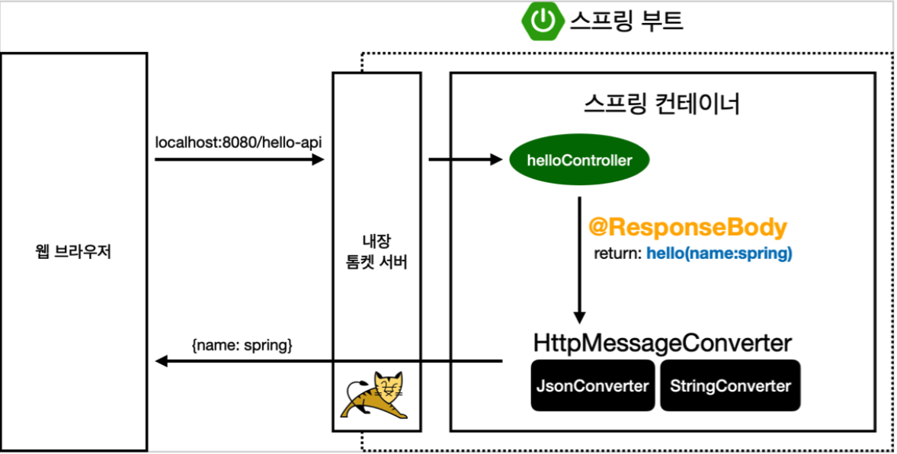
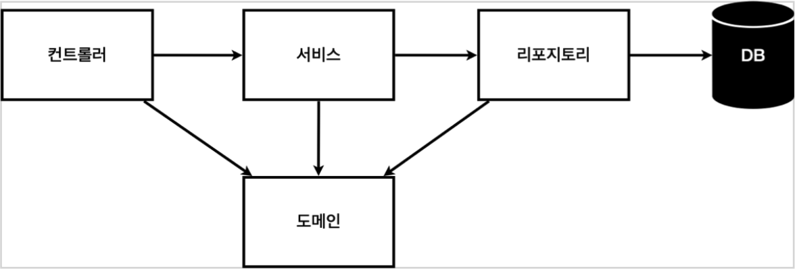

# 스프링 입문 - 코드로 배우는 스프링 부트, 웹 MVC, DB 접근 기술

[https://www.inflearn.com/course/%EC%8A%A4%ED%94%84%EB%A7%81-%EC%9E%85%EB%AC%B8-%EC%8A%A4%ED%94%84%EB%A7%81%EB%B6%80%ED%8A%B8](https://www.inflearn.com/course/%EC%8A%A4%ED%94%84%EB%A7%81-%EC%9E%85%EB%AC%B8-%EC%8A%A4%ED%94%84%EB%A7%81%EB%B6%80%ED%8A%B8)

## 라이브러리 살펴보기

- spring-boot-starter-web
- spring-boot-starter(공통): 스프링 부트 + 스프링 코어 + 로깅

> SDK 만들때 spring 모듈 구조 참고해도 좋을 듯

## @ResponseBody 사용원리

- ResponseBody, 템플릿 엔진 다 크게는 비슷한 흐름을 가진다
- Response Data들이 들어있는데 객체를 JSON으로 바꿔주는 annotation이 `@ResponseBody`.
- `@ResponseBody`가 걸려있으면, `HttpMessageConverter` 통해서 변환해준다. 굉장히 간편한 기능인듯!

## 회원 관리 예제 - 백엔드 개발

- 컨트롤러: 웹 MVC의 컨트롤러 역할
- 서비스: 핵심 비즈니스 로직 구현
- 리포지토리: 데이터베이스에 접근, 도메인 객체를 DB에 저장하고 관리
- 도메인: 비즈니스 도메인 객체, 예) 회원, 주문, 쿠폰 등등 주로 데이터베이스에 저장하고 관리됨

> 도메인 레이어가 아직은 제대로 이해가 되지 않는다... DB에 저장하는 데이터를 객체로 만들어 둔걸로 보면 되는걸까?
